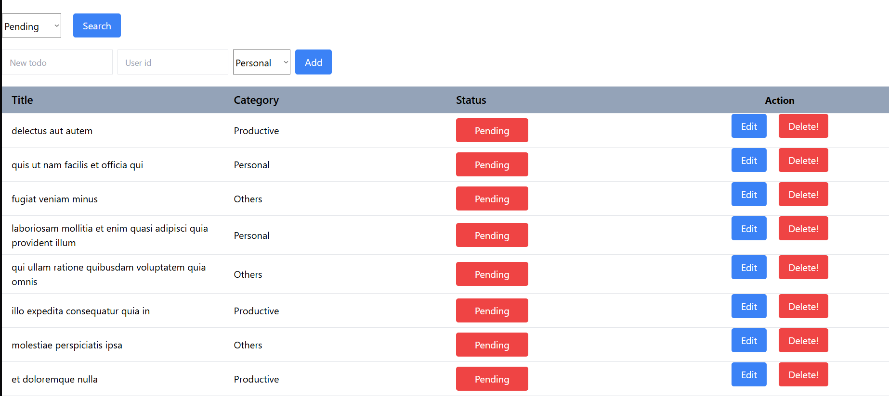
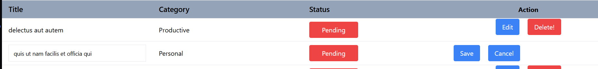

# Todo List Project – Fujitsu Test

**Abiel Bagas Satrio Jati**

## Persiapan Environment

1. Salin file `.env.example` lalu ubah namanya menjadi `.env`.
2. Isi nilai `VITE_BASE_URL` sesuai base URL Vite.
   - Default: `http://localhost:5173`

---

## Fitur

Proyek ini memiliki beberapa fitur berikut:

- Mengambil data Todo dari API:  
  `https://jsonplaceholder.typicode.com`
- Menambahkan Todo baru
- Menghapus Todo
- Mengedit Todo dan menandai Todo sebagai selesai
- Filter Todo berdasarkan status
- Animasi loading sederhana

---

## Tangkapan Layar Aplikasi

  
  

---
